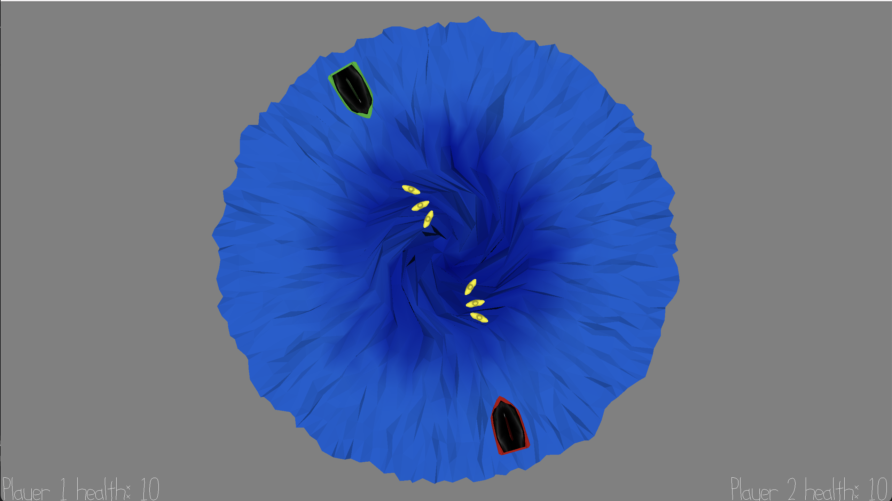

# Sink or Spin

Author: Flora Cheng

Design: A two playered game, where players move and shoot from a ship, trying to hit the other player's ship. But they aren't on a normal playing field! The ships move accross a whirlpool that tries to pull them in and the bullets fly in arcs.

Screen Shot:

How To Play:

Your goal: outlive the other player, wheather by surviving the whirlpool or shooting down your opponent! If you are in the center of the whirlpool, you will gradually lose health.
Be aware, you can only have 3 bullets at a time and they fly in arcs/with gravity! The bullets will fire in the direction that the boat is pointing towards

Player 1: move using wasd and fire using f

Player 2: move using up/down/left/right arrows and fire using /

If the water motion makes you motion sick, feel free to comment out this [line](https://github.com/flowerflora/VirtualWorldGame/blob/main/PlayMode.cpp#L282)
This game was built with [NEST](NEST.md).
